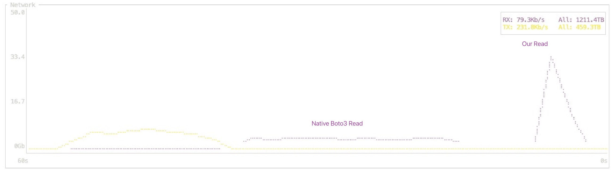

<h1 align="center">easy_io</h1>

<p align="center">
  <a href="https://pypi.org/project/py-ezio/">
    
  </a>
  <a href="https://pypi.org/project/py-ezio/">
    
  </a>
  <a href="https://github.com/qsh-zh/easy_io">
    
  </a>
  <a href="https://qsh-zh.github.io/easy_io/">
    
  </a>
  <a href="https://pypi.org/project/py-ezio/">
    
  </a>
</p>

<p align="center">
  <i>Simple IO APIs with pluggable storage backends and rich format handlers.</i>
</p>

## Introduction

`easy_io` wraps a tiny set of intuitive helpers—`load`, `dump`, `get`, `put`, `copyfile`, and friends—so you can move data with minimal boilerplate. The same API works across local paths, HTTP/S endpoints, S3 buckets, and any other registered backend while automatically selecting the right format handler for text, JSON, YAML, pickle, NumPy arrays, and more. Whether you need a quick round-trip or a fully managed remote sync, you keep the same simple calls.

### Core features

- **Simple surface area** – a handful of functions to read, write, copy, list, and remove files or directories without juggling clients.
- **Storage flexibility** – plug in or cache backends (`set_s3_backend`, `get_file_backend`) to reuse credentials and talk to multiple storage systems.
- **Format awareness** – `easy_io.load`/`easy_io.dump` infer or accept formats and delegate to rich handlers so serialization just works.
- **Productive extras** – mirror assets locally (`get_local_path`, `copyfile_to_local`), generate presigned URLs, and perform tree-level operations across backends.
- **Optimized S3 transfers** – a pure-Python `Boto3Client` combines asyncio, shared memory, and multiprocess-driven multipart uploads/downloads for roughly 2-10x faster large-file throughput in AWS tests.



The project draws inspiration from [mmengine](https://github.com/open-mmlab/mmengine) and the [jammy](https://gitlab.com/qsh.zh/jam/) toolbox while re-packaging the ideas into a focused, backend-oriented IO helper.

## User Guide

### Installation

```bash
pip install py-ezio
```

### Quickstart

```python
from pathlib import Path

import easy_io

# Write and read text without caring about the underlying storage.
easy_io.put_text("hello backend", "tmp/examples/hello.txt")
print(easy_io.get_text("tmp/examples/hello.txt"))

# Materialize a remote (or local) file into a temporary path when needed.
with easy_io.get_local_path("tmp/examples/hello.txt") as local_path:
    print(Path(local_path).read_text())

# Copy, inspect, and clean up just as you would with pathlib or shutil.
easy_io.copyfile("tmp/examples/hello.txt", "tmp/examples/hello_copy.txt")
print(list(easy_io.list_dir_or_file("tmp/examples/")))
easy_io.remove("tmp/examples/hello.txt")
easy_io.remove("tmp/examples/hello_copy.txt")
```

### Common Workflows

#### Local file round-trip

```python
import easy_io

dummy_dict = {"a": 1, "b": 2}

easy_io.dump(dummy_dict, "dummy_dict.pkl")
loaded = easy_io.load("dummy_dict.pkl")

assert loaded == dummy_dict

easy_io.remove("dummy_dict.pkl")
```

#### Configure the S3 backend

```python
import easy_io

easy_io.set_s3_backend(
    backend_args={
        "backend": "s3",
        "path_mapping": None,
        "s3_credential_path": "credentials/abc.secret",
    }
)

for ith, path in enumerate(easy_io.list_dir_or_file("s3://checkpoints/")):
    if ith > 5:
        break
    print(path)

easy_io.copyfile_from_local(
    "pyproject.toml",
    "s3://checkpoints/pyproject.toml",
)
easy_io.remove("s3://checkpoints/pyproject.toml")

# Upload large objects with the optimized client.
backend = easy_io.get_file_backend("s3://checkpoints/pyproject-fast.pkl")
easy_io.dump({"payload": 42}, "payload.pkl")
backend.fast_put("payload.pkl", "s3://checkpoints/pyproject-fast.pkl")
easy_io.remove("payload.pkl")
```

### CLI helper: `ezio_load`

Installations from PyPI expose an `ezio_load` entry point for quick inspection of
one or more files. Each file is loaded with `easy_io.load` and registered in an
interactive IPython session as `f1`, `f2`, etc.

```bash
ezio_load data/example.pkl
```

You can pass multiple paths (local or remote). When you exit the IPython shell,
the command ends.

## Developer Guide

### Environment Setup

```bash
# 1. Use Python 3.9+ and install uv if it is not already available
pip install uv

# 2. Create an isolated environment (uv uses .venv by default)
uv venv

# 3. Activate the virtual environment
source .venv/bin/activate  # or the Windows/conda equivalent

# 4. Install the core dependencies
uv sync

# Optional: tune logging verbosity for CLI sessions
export EASY_IO_LOG_LEVEL=DEBUG

# Optional: change the log tag prefix shown in log lines
export EASY_LOG_LOG_TAG="MyService"
```

`easy_io.log` prefixes messages with `EASY_LOG_LOG_TAG` (defaults to `EASY_IO`) and
defaults to rank-zero logging when `torch.distributed` is initialized. Set
`easy_io.log.RANK0_ONLY = False` in code if you need messages from every worker.

### Tests and linting

```bash
uv sync --dev
uv run pytest
uv run ruff check
```

### Documentation

```bash
uv sync --group docs
uv run sphinx-build -b html docs docs/_build/html
python -m http.server --directory docs/_build/html 8000
```

Published documentation is available at https://qsh-zh.github.io/easy_io/ once the `Docs` workflow has run (triggered automatically on pushes to `main` or manually via GitHub Actions).

### Release tooling

```bash
uv sync --group release
uv run python -m build
uv run twine check dist/*
```

### Publishing

Publishing to PyPI is automated via GitHub Actions (`.github/workflows/publish.yml`).
Create a PyPI trusted publisher or add the `PYPI_API_TOKEN` repository secret. Then
tag a release using a semantic version (no leading `v`):

```bash
git tag 0.1.0
git push origin 0.1.0
```

Tags must follow the `MAJOR.MINOR.PATCH` pattern (for example, `1.2.3`).

The workflow will build and publish the project with `uv publish`.

For manual publishes:

```bash
uv sync --group release
export UV_PUBLISH_TOKEN="$(pass show pypi/token)"  # or export from your secret manager
uv publish --token "$UV_PUBLISH_TOKEN"
```

### Project Structure

- `pyproject.toml` – project metadata and dependency management (driven by uv)
- `easy_io/` – package source code
- `docs/` – Sphinx sources for the documentation portal

### Contributing

Contributions are welcome! Please open an issue or pull request describing the
change you would like to make. Run the full test and lint suite before submitting
and follow the existing code style. If your change affects user workflows, update
the documentation and add regression tests where practical.
